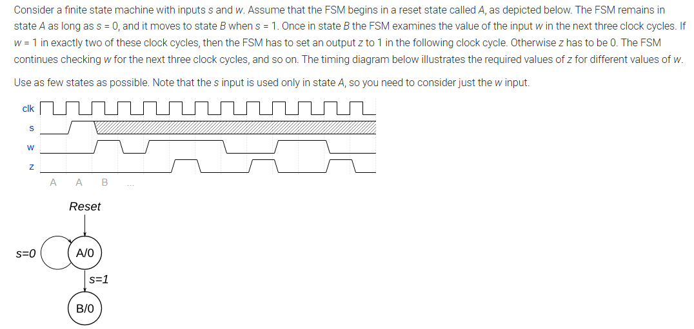
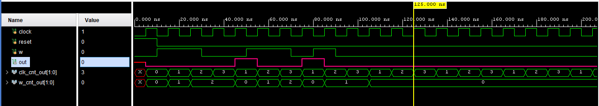

# FSM Clock Detector (FSM1)

## Problem Statement
Finite State Machine that detects when exactly 2 of 3 consecutive clock cycles have `w=1`.



## Waveform Screenshot
Below is the simulation waveform captured from the testbench run.



> The waveform image is `Waveform_Vivado.png` in this directory.

### Behavior
- **State A**: Initial/reset state. Waits for `s=1` input.
- **State B**: Active state. Monitors input `w` over 3-cycle windows.
  - If `w=1` in exactly 2 of the 3 cycles → output `z=1` on the next cycle
  - Otherwise → output `z=0`
  - Process repeats for the next 3-cycle window

### Inputs
- `clk`: Clock signal
- `reset`: Synchronous reset
- `s`: State transition control (0=stay in A, 1=go to B)
- `w`: Data input to monitor

### Output
- `z`: 1 when exactly 2 of the last 3 `w` inputs were 1, else 0

## Files
- **fsm_clk_detect.v**: Design module (Verilog RTL)
- **fsm_clk_detect_tb.v**: Comprehensive testbench
- **fsm_clk_detect.vcd**: Waveform dump file (for GTKWave)
- **README.md**: This file

## Compilation & Simulation
```bash
# Compile
iverilog -o fsm_clk_detect_sim fsm_clk_detect.v fsm_clk_detect_tb.v

# Run simulation
vvp fsm_clk_detect_sim

# View waveforms (requires GTKWave)
gtkwave fsm_clk_detect.vcd
```

## Test Coverage
The testbench validates:
- State transitions (A→B on s=1)
- Multiple 3-cycle windows with different `w` patterns
- Cases with 0, 1, 2, and 3 ones in the 3-cycle window
- Correct z output generation
