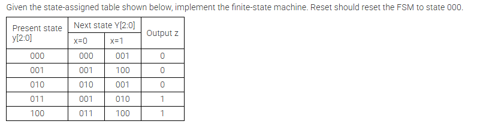

# FSM2 - State Assigned FSM

## Problem Statement
Given the state-assigned table below, implement the finite-state machine.
Reset should reset the FSM to state `000`.



## State Table
| Present state y[2:0] | Next state Y[2:0] when x=0 | Next state Y[2:0] when x=1 | Output z |
|----------------------|----------------------------|----------------------------|----------|
| 000                  | 000                        | 001                        | 0        |
| 001                  | 001                        | 100                        | 0        |
| 010                  | 010                        | 001                        | 0        |
| 011                  | 001                        | 010                        | 1        |
| 100                  | 011                        | 100                        | 1        |

## Files
- `top_module.v` — Verilog implementation of the FSM.
- `top_module_tb.v` — Testbench for simulation.
- `FSM2.png` — Problem statement image.

## Notes
- `reset` is synchronous and returns the FSM to state `000`.
- `x` controls transitions according to the table.
- `z` is asserted for the states that output 1.

## Simulation
```bash
iverilog -o top_module_sim top_module.v top_module_tb.v
vvp top_module_sim
```
