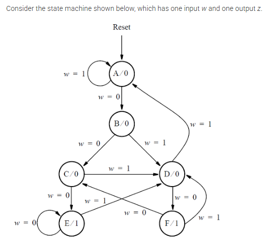

# FSM3 — Moore FSM (binary-encoded)

This directory contains a Moore finite-state machine implemented in Verilog and a testbench to exercise its behavior.

Module: `top_module` (in `fsm3_module.v`)

Description:
- Synchronous Moore FSM with a 3-bit binary state register (`state`).
- Inputs: `clk`, `reset` (synchronous), `w`.
- Output: `z` (depends only on the current state).

## Problem Statement

The FSM problem diagram is shown below:



State encoding (3-bit binary):

- A = 3'b000
- B = 3'b001
- C = 3'b010
- D = 3'b011
- E = 3'b100
- F = 3'b101

Note on output:
- `assign z = state[2];` — output `z` is 1 when the state is `E` (100) or `F` (101).

Files:

- `fsm3_module.v` — DUT implementing the FSM.
- `fsm3_tb.v` — Testbench that toggles `clk`, applies `reset`, and drives `w` to exercise transitions.
- `fsm3_tb.vcd` — Generated waveform (not committed by default).

Simulation:

From this directory, run:

```bash
iverilog -o tb.vvp fsm3_module.v fsm3_tb.v
vvp tb.vvp
```

Waveforms are written to `fsm3_tb.vcd` for inspection with GTKWave:

```bash
gtkwave fsm3_tb.vcd
```
