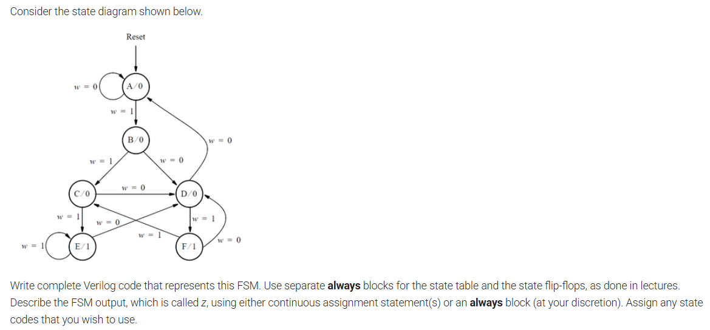

# FSM4

## Problem Statement
Consider the state diagram shown below.

Write complete Verilog code that represents this FSM. Use separate `always` blocks for the state table and the state flip-flops, as done in lectures. Describe the FSM output, which is called `z`, using either continuous assignment statement(s) or an `always` block (at your discretion). Assign any state codes that you wish to use.

## Files
- `fsm4_design.v` - top-level Verilog implementation of the FSM
- `fsm4_tb.v` - Verilog testbench used to verify the FSM
- `fsm4_tb.vcd` - waveform output generated by simulation
- `fsm4_testbench.vvp` - compiled simulation executable

## Notes
- The FSM uses one-hot state encoding.
- The reset is synchronous and active-high.
- Output `z` is asserted in state `E` or state `F`.
