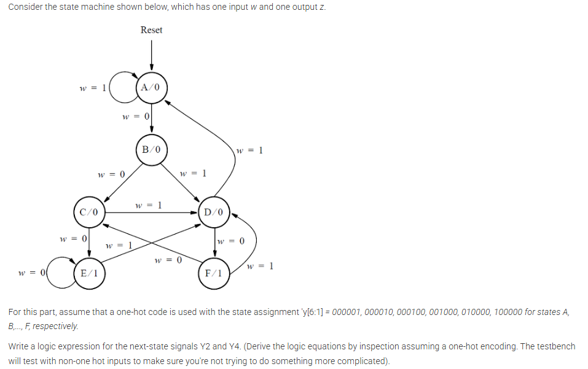

# FSM One-Hot Encode

This folder contains a solved HDLBits problem for a one-hot encoded finite state machine.

## Problem Statement

The problem statement is shown in the image below:



## Files

- `fsm_one_hot_test.v` - DUT module implementing the FSM outputs.
- `fsm_one_hot_tb.v` - Testbench for the DUT.
- `FSM_One_Hot_Encode.png` - Problem statement image.

## Simulation

Compile and run with:

```bash
iverilog -o tb.vvp fsm_one_hot_test.v fsm_one_hot_tb.v
vvp tb.vvp
```

The waveform is dumped to `fsm_one_hot_tb.vcd`.
