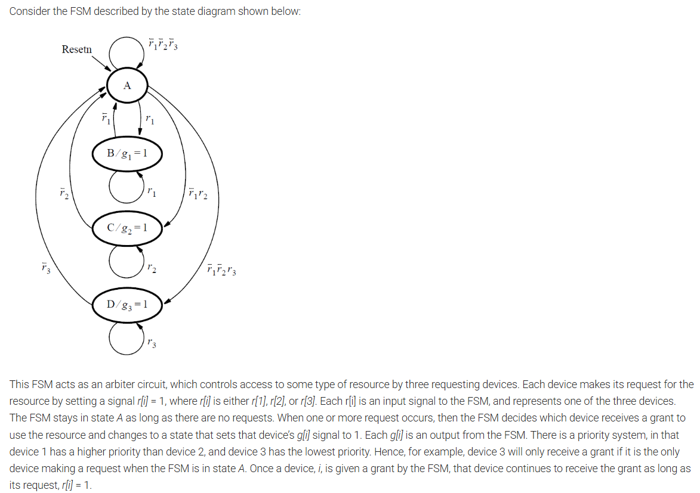

# FSM Requester Grant

This directory contains a Verilog implementation of a request/grant finite state machine.



## Design
The `top_module` implements a synchronous FSM with an active-low reset (`resetn`). It receives a 3-bit request vector `r[3:1]` and asserts a corresponding grant output `g[3:1]`.

The FSM states are:
- `A` (idle) when no request is active
- `B` when request line `r[1]` is granted
- `C` when request line `r[2]` is granted
- `D` when request line `r[3]` is granted

A helper module, `req_priority_schedule`, selects the highest priority pending request. Priority is given to `r[1]` first, then `r[2]`, then `r[3]`.

## Files
- `fsm_req_grant.v`: Design module containing `top_module` and request decoder.
- `fsm_req_grant_tb.v`: Testbench for `top_module`.
- `README.md`: This file.

## Simulation
Use Icarus Verilog to compile and simulate the design.

```bash
iverilog -o fsm_req_grant_sim fsm_req_grant.v fsm_req_grant_tb.v
vvp fsm_req_grant_sim
```

To inspect signal waveforms:

```bash
gtkwave fsm_req_grant.vcd
```

## Testbench Behavior
The testbench verifies:
- reset behavior and idle state with no requests
- grant to `g[1]` when `r[1]` is asserted
- grant to `g[2]` when `r[2]` is asserted
- grant to `g[3]` when `r[3]` is asserted
- priority behavior when multiple requests are active
- return to idle state when all requests are removed

## Notes
- `resetn` is active-low and synchronous.
- Outputs `g[1]`, `g[2]`, and `g[3]` are asserted only in states `B`, `C`, and `D`, respectively.
