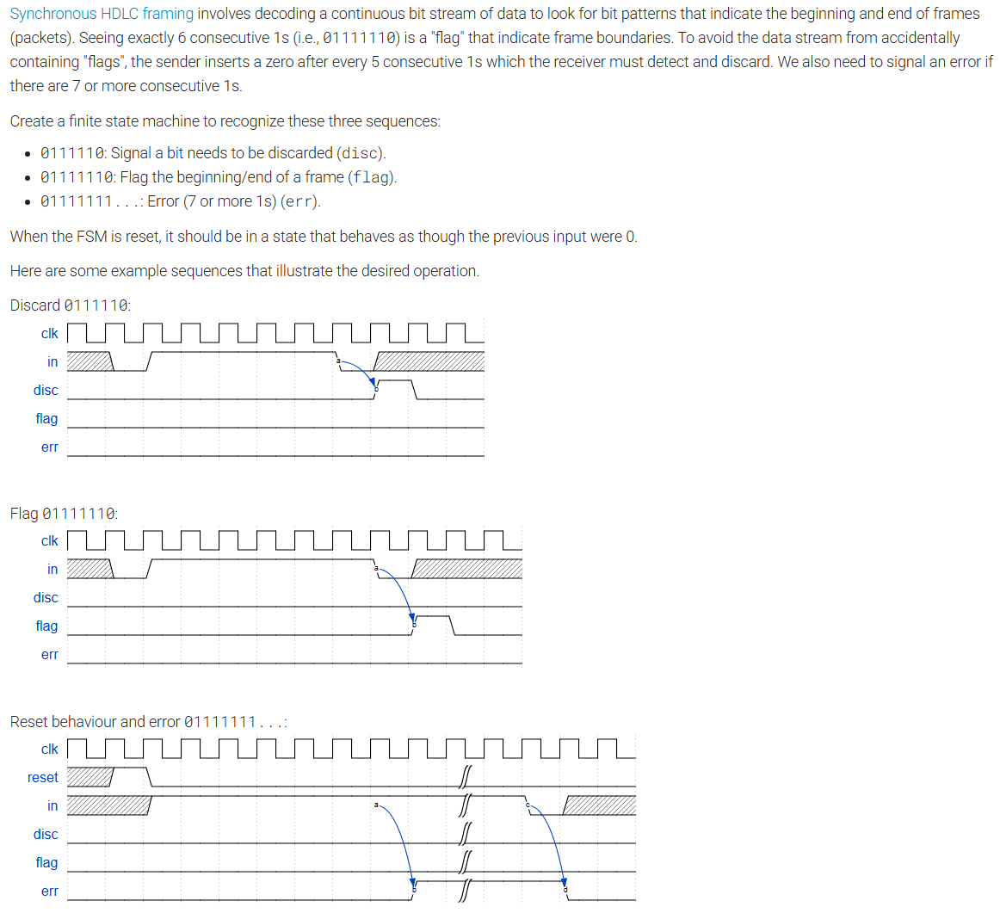

# FSM Packet Checker

This directory contains a simple finite state machine that classifies input packet patterns based on consecutive ones and a terminating zero.

## Problem Statement

The problem statement is included as an image file in this directory:



## Module

- `fsm_packet.v`: top-level Verilog RTL module implementing the packet checker.
  - `clk`: clock input.
  - `reset`: synchronous reset input.
  - `in`: serial packet input bit.
  - `disc`: output asserted for the pattern `0111110`.
  - `flag`: output asserted for the pattern `01111110`.
  - `err`: output asserted when more than six consecutive ones are received and held until a zero arrives.

## Testbench

- `fsm_packet_tb.v`: testbench for the packet checker.
  - verifies discard detection for `0111110`
  - verifies flag detection for `01111110`
  - verifies error entry and recovery after too many consecutive ones
  - checks that no false pulses occur for an all-zero run

## Simulation

Run the following command from the `FSM_packet_checker` directory:

```sh
iverilog -o fsm_packet_tb.vvp fsm_packet.v fsm_packet_tb.v && vvp fsm_packet_tb.vvp
```

If your simulator is installed, this will compile and execute the testbench.
